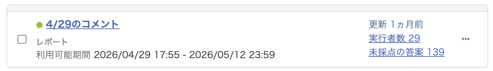
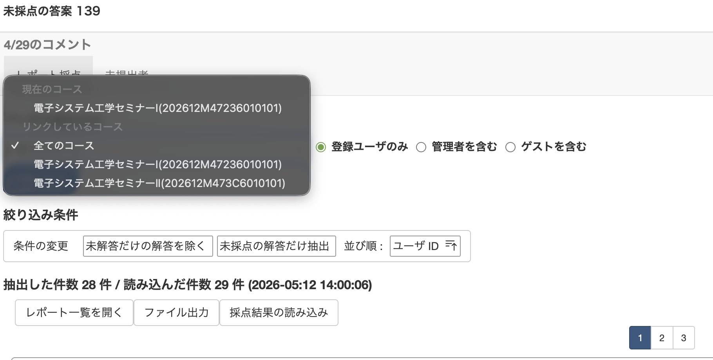
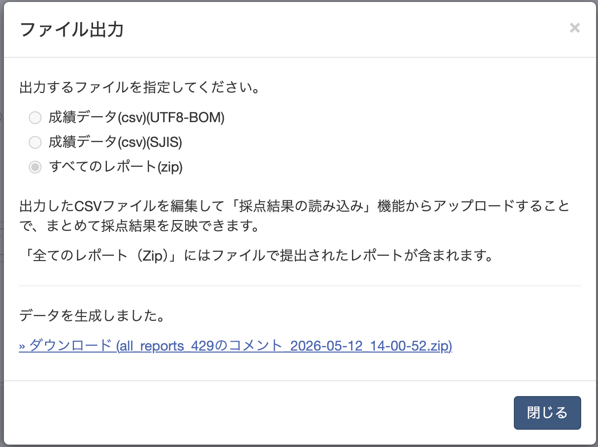

# セミナーコメント集計ツール

電子システム工学セミナー（全体輪講）などで UNIPA からエクスポートしたコメント ZIP を、**発表者ごとの CSV ファイルに自動で分割**するデスクトップアプリです。

- 発表者を CSV から自動検出し、確認・修正できます
- コメントの順番をランダム化し、提出順から氏名を特定されないようにします
- Mac・Windows 両対応

## ダウンロード

[Releases](https://github.com/GenSSK/Semminer-Comment-Splitter/releases) から最新版をダウンロードしてください。

| ファイル | 対象 |
|---------|------|
| `SeminarCommentSplitter-mac.dmg` | macOS 12 以降（Apple Silicon ネイティブ / Intel は Rosetta 2） |
| `SeminarCommentSplitter.exe` | Windows 10/11 |

> **Mac 初回起動時**: DMG を開いて `.app` を Applications フォルダへドラッグ。初回のみ右クリック →「開く」→「開く」を選択（Gatekeeper の警告を回避）  
> **Windows 初回起動時**: `.exe` を右クリック →「その他の情報」→「実行」を選択してください（SmartScreen の警告を回避）

---

## 使い方

### Step 1 — UNIPA からコメントデータをダウンロードする

**1-1.** UNIPA で対象のコメント教材を開き、**「未採点の答案」** をクリックします。



**1-2.** 「データの読み込み」プルダウンから **「全てのコース」** を選択し、**「再読み込み」** をクリックします。



**1-3.** **「ファイル出力」** をクリック →「すべてのレポート (zip)」を選択 → **「データを生成」** をクリックします。  
生成されたリンクから **ZIP ファイルをダウンロード**します。



---

### Step 2 — アプリで集計する

**2-1. ZIP を読み込む**

アプリを起動し、ダウンロードした ZIP ファイルをドロップゾーンにドラッグ&ドロップするか、「ZIP を選択…」ボタンで開きます。

**2-2. 発表者リストを確認・修正する**

ZIP の読み込み後、発表者が自動検出されてリストに表示されます。  
検出できなかった場合は学籍番号・氏名を直接入力してください。  
発表順が違う場合は、行左端の `⠿` ハンドルをドラッグして順番を入れ替えられます。

**2-3. 出力先フォルダを選択する**

「フォルダを選択…」ボタンで出力先を指定します（デフォルトは ZIP と同じフォルダ）。  
「サブフォルダを作成」にチェックを入れると、ZIP ファイル名のフォルダが自動生成されます。

**2-4. 集計を実行する**

「集計を実行」ボタンをクリックすると、発表者ごとに以下のファイルが出力されます。

```
集計コメント_<学籍番号>_<氏名>.csv
```

---

## 出力 CSV について

- エンコーディング: **UTF-8 BOM 付き**（Excel でそのまま開けます）
- 列: `コメント` のみ
- コメント先頭に書かれた他者の学籍番号は自動で削除されます
- コメントの順番はランダム化されます

---

## 開発者向け

### 必要環境

- Python 3.12+
- [uv](https://docs.astral.sh/uv/)

### セットアップ

```bash
git clone https://github.com/GenSSK/Semminer-Comment-Splitter.git
cd Semminer-Comment-Splitter
uv sync
uv run python app.py
```

### macOS アプリのビルド

```bash
bash build_mac.sh
# → dist/セミナーコメント集計ツール.app
```

### Windows アプリのビルド（GitHub Actions）

`v*` タグを push すると GitHub Actions が自動で Mac・Windows 版をビルドし、Releases に公開します。

```bash
git tag v1.0.0
git push origin v1.0.0
```

GitHub Actions で Windows 版をビルドするには、以下のシークレットを設定してください。

| シークレット名 | 内容 |
|--------------|------|
| `MACOS_CERTIFICATE` | `.p12` 証明書を Base64 エンコードした文字列 |
| `MACOS_CERTIFICATE_PWD` | `.p12` 書き出し時のパスワード |
| `KEYCHAIN_PASSWORD` | CI の一時キーチェーン用（任意の文字列） |

---

## ライセンス

[MIT License](LICENSE) © 2026 Genki Sasaki
